<p align="center">
  
</p>

<h3 align="center">🌐 Connect With Me</h3>
  <br>
<p align="center">

<a href="https://vigneshwaran2006.vercel.app/" target="_blank">

</a>

<a href="https://vigneshwaran2006.vercel.app/Vigneshwaran_S_Resume_Updated.pdf" target="_blank">

</a>

<a href="https://github.com/Vikki-2006" target="_blank">

</a>

<a href="https://www.linkedin.com/in/vigneshwaran-s-1b4364369/" target="_blank">

</a>

<a href="https://x.com/Vignesh72625559" target="_blank">

</a>

<a href="https://www.reddit.com/u/Lalo_vikki/" target="_blank">

</a>

<a href="mailto:vikki.29062006@gmail.com">

</a>

</p>

## 👨‍💻 About Me
```javascript
const me = {
    role: "Full Stack Developer",
    code: ["Python", "C", "C++", "React"],
    learning: ["DSA", "System Design"],
    building: "Scalable Web Applications",
    goal: "Build software that creates real-world impact."
};
```

## 🖥️ Tech Stack

### 💻 Programming Languages


### 🎨 Frontend Development


### ⚡ Backend Development


### 🗄️ Database


### 🤖 AI & APIs


### ☁️ Deployment


### 🛠️ Tools & Platforms


### 📚 Currently Learning


<p align="center">

</p>

## 📈 GitHub Analytics

<p align="center">
  
  
</p>

<p align="center">
  
</p>

<p align="center">

</p>

## 🏆 Coding Profiles
<br>
<p align="center">
  <a href="https://leetcode.com/u/Vikki-2006/" target="_blank">
    
  </a>
  <a href="https://www.codechef.com/users/vikki2006" target="_blank">
    
  </a>
  <a href="https://www.geeksforgeeks.org/profile/waranlli3?from=explore" target="_blank">
    
  </a>
  <a href="https://www.hackerrank.com/profile/Vikki_2006" target="_blank">
    
  </a>
</p>
<br>

## 📌 Featured Projects

<table>
<tr>
<td width="50%" align="center">

### ♻️ Smart Waste Collection System

AI-powered IoT waste management system with real-time monitoring and route optimization.

**Tech Stack**

`Python` `Flask` `Firebase` `ESP8266` `Google Maps API`

<a href="https://github.com/Vikki-2006/smart-waste-system">

</a>

</td>
<td width="50%" align="center">

### 🌐 Portfolio Website

Personal developer portfolio with responsive design, smooth animations, and modern UI.

**Tech Stack**

`React` `TypeScript` `Tailwind CSS` `Framer Motion` `Vite`

<a href="https://vigneshwaran2006.vercel.app">

</a>

<a href="https://github.com/Vikki-2006/Portfolio">

</a>

</td>
</tr>
</table>
<br><br>

## 📫 Let's Connect
<br>
<p align="center">
  <a href="https://www.linkedin.com/in/vigneshwaran-s-1b4364369/">
    
  </a>

  <a href="mailto:vikki.29062006@gmail.com">
    
  </a>

  <a href="https://vigneshwaran2006.vercel.app">
    
  </a>
</p>
<br>
<p align="center">
  
</p>
